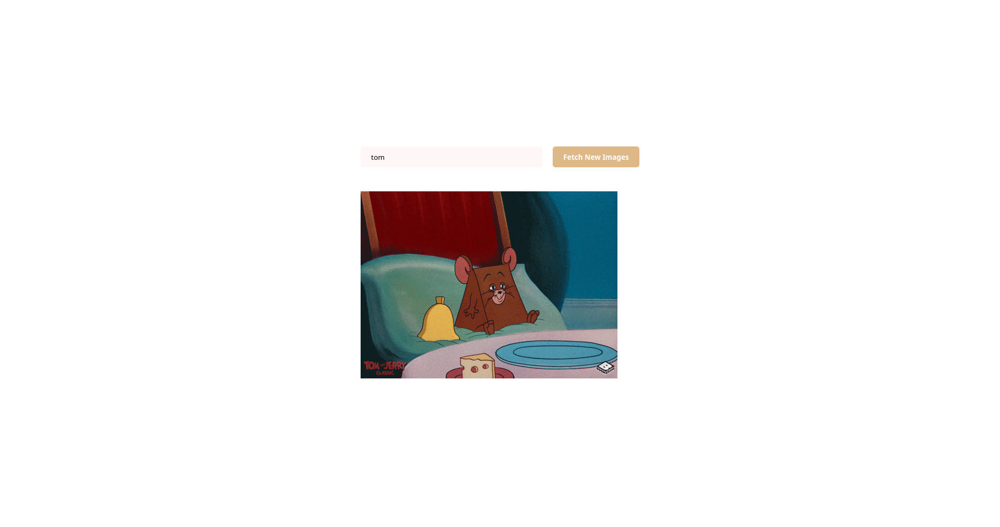

# Odin Working With API

## Table of contents

- [Overview](#overview)
  - [The challenge](#the-challenge)
  - [Screenshot](#screenshot)
  - [Links](#links)
- [My process](#my-process)
  - [Built with](#built-with)
  - [What I learned](#what-i-learned)
  - [Continued development](#continued-development)
  - [Useful resources](#useful-resources)

### The challenge

Users should be able to:

- Fetch random and search GIF

### Screenshot



### Links

- Live Site URL: [Preview](https://azanra.github.io/odin-working-with-api/)

## My process

### Built with

- Javascript fetch and promises

### What I learned

Fetching / sending data to a server with fetch method, where it receive an 2 arguments, first is the url or url object, and second is options to setting up our fetch method. it will return a promises object, with the current state of either pending, resolved, or rejected, we check the response status, if it not okay throw an error. and if it okay we return the response and convert it from JSON format into javascript object. then the promise will be consumed by the then method, which will proccess the data. then have two argument, the first argument is on what to do if the promises is resolved, while the second one is for if the promise is rejected, we can make the then focus only on resolved, and for the error will be processed by catch method, which received error as argument and process the rejected promises.

```js
const fetchImg = (keyword) => {
  const API = `https://api.giphy.com/v1/gifs/translate?api_key=${API_KEY}&s=${keyword}`;
  fetch(API)
    .then((response) => {
      if (!response.ok) {
        throw new Error(`Failed fetch: ${response.status}`);
      }
      return response.json();
    })
    .then((result) => {
      // process the resolved promises
    })
    .catch((error) => {
      // process the rejected promises
    });
};
```

API is the server that contain data for external use. By sending / receiving responses from the client into a server. client will send a request with the header that have the information of the request itself like the origin(url of the request), type of request (get/post/...) whether it allow cross origin resource sharing. and server will check whether it allow the origin, type of the request, and CORS of the request if it allow it then send back the response into client. the web will be become the middleman between the client and the server and pass the information between the two. if it have request type that more complex like post, it will sent preflight request first, before sending the main request. if the prefligt request is allowed it will cached it.

By default browser reject for any HTTP request to external source, and to allow it we provide mode options to cors to out option fetch method.

### Useful resources

- [Odin Working with API](https://www.theodinproject.com/lessons/node-path-javascript-working-with-apis) - Contain explanation and link to external resource on how to use fetch method to use an api
